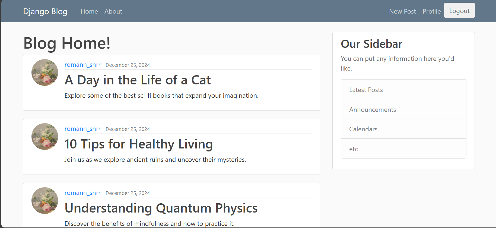

# Portfolio

Welcome to my personal portfolio website! This project is built using React and showcases my projects, skills, and experiences in web development. The site is designed to be responsive and user-friendly, providing a seamless experience across different devices.

## Table of Contents

- [Features](#features)
- [Technologies Used](#technologies-used)
- [Installation](#installation)
- [Usage](#usage)
- [Project Structure](#project-structure)
- [Contributing](#contributing)
- [License](#license)
- [Contact](#contact)

## Features

- **Responsive Design**: The website is fully responsive and works on all devices.
- **Project Showcase**: Displays a list of my projects with descriptions, images, and links to the source code.
- **Skills Section**: Highlights my technical skills and proficiencies.
- **Experience Section**: Details my professional experiences and roles.
- **Contact Form**: Allows visitors to get in touch with me directly through the website.

## Technologies Used

- **Frontend**: React, HTML, CSS, JavaScript
- **Styling**: Tailwind CSS
- **Deployment**: GitHub Pages

## Installation

To run this project locally, follow these steps:

1. **Clone the repository**:
    ```bash
    git clone https://github.com/your-username/portfolio.git
    ```
2. **Navigate to the project directory**:
    ```bash
    cd portfolio
    ```
3. **Install dependencies**:
    ```bash
    npm install
    ```
4. **Start the development server**:
    ```bash
    npm start
    ```

The website should now be running on `http://localhost:3000`.

## Usage

- **Home Page**: Introduction and brief overview of who I am.
- **Projects Page**: Detailed view of my projects with images and links.
- **Skills Page**: List of my technical skills.
- **Experience Page**: My professional experiences and roles.
- **Contact Page**: Form to send me a message directly.

## Project Structure

```plaintext
portfolio/
├── public/
│   ├── images/
│   │   └── profile.jpg
│   └── index.html
├── src/
│   ├── components/
│   │   ├── Header.jsx
│   │   ├── Footer.jsx
│   │   ├── Projects.jsx
│   │   └── ContactForm.jsx
│   ├── pages/
│   │   ├── Home.jsx
│   │   ├── Projects.jsx
│   │   ├── Skills.jsx
│   │   └── Experience.jsx
│   ├── App.js
│   ├── index.js
│   └── styles.css
├── .gitignore
├── package.json
└── README.md
