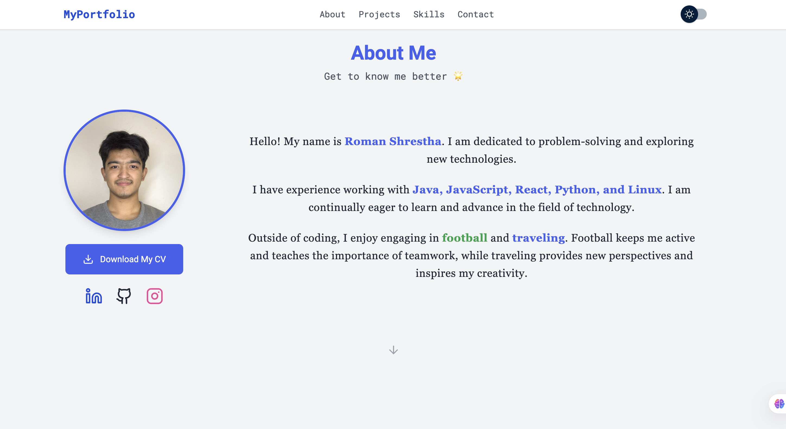
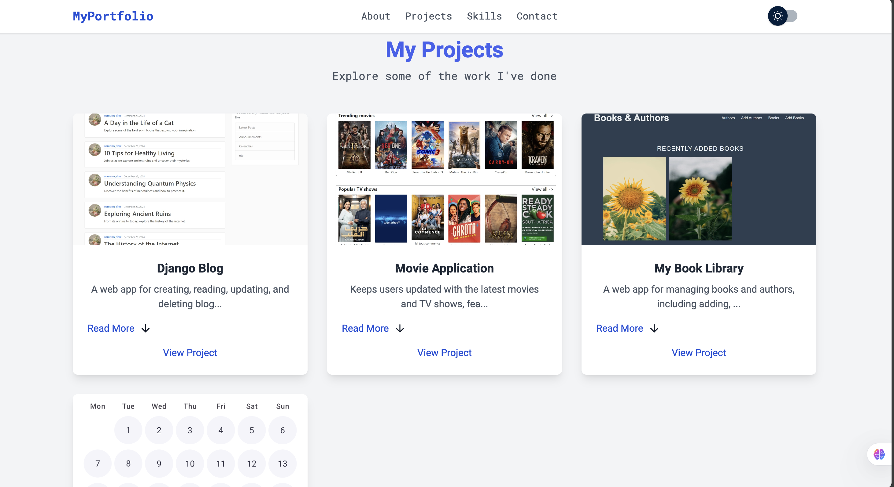
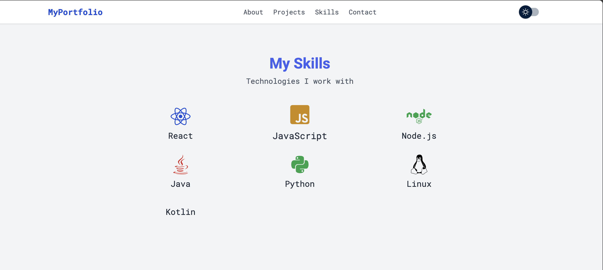
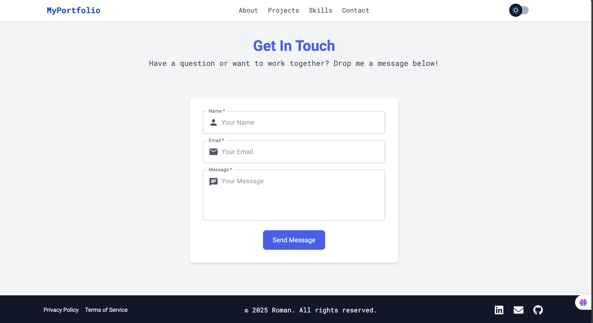

# Portfolio

[](https://github.com/romanshrestha20/portfolio/actions/workflows/pages/pages-build-deployment)
[](https://github.com/romanshrestha20/portfolio/actions/workflows/deploy.yml)

Welcome to my personal portfolio website! This project is built using React and showcases my projects, skills, and experiences in web development. The site is fully responsive and optimized for a seamless experience on all devices.

🌐 **Live Demo:** [https://romanshrestha.info](https://romanshrestha.info)

---

## Table of Contents

* [Features](#features)
* [Technologies Used](#technologies-used)
* [Installation](#installation)
* [Usage](#usage)
* [Project Structure](#project-structure)
* [Screenshots](#screenshots)
* [Contributing](#contributing)
* [License](#license)
* [Contact](#contact)

---

## Features

* **Responsive Design**: Works perfectly on desktop, tablet, and mobile devices.
* **Project Showcase**: Displays projects with detailed descriptions and source code links.
* **Skills Section**: Highlights technical skills and proficiencies.
* **Experience Section**: Shares professional experience and roles.
* **Contact Form**: Enables visitors to send messages directly.
* **Dark Mode Toggle**: User-friendly light/dark theme switch.

---

## Technologies Used

* **Frontend**: React, HTML5, CSS3, JavaScript
* **Styling**: Tailwind CSS
* **Deployment**: GitHub Pages

---

## Installation

To run this project locally, follow these steps:

```bash
# Clone the repo
git clone https://github.com/romanshrestha20/portfolio.git

# Navigate into the project directory
cd portfolio

# Install dependencies
npm install

# Start the development server
npm start
```

Visit [http://localhost:3000](http://localhost:3000) to see the site in action.

---

## Usage

* **Home Page**: Introduction and brief overview.
* **Projects Page**: View detailed projects with descriptions and links.
* **Skills Page**: Overview of my technical skillset.
* **Experience Page**: Highlights my career journey.
* **Contact Page**: Form to get in touch.
* **Footer**: Links to social media and GitHub.

---

## Project Structure

```plaintext
portfolio/
├── public/
│   ├── images/
│   │   ├── homepage.png
│   │   ├── projects.png
│   │   ├── skills.png
│   │   ├── contact.png
│   │   └── contact-form-screenshot.png
│   └── index.html
├── src/
│   ├── components/
│   │   ├── about/
│   │   ├── common/
│   │   ├── contact/
│   │   ├── footer/
│   │   ├── home/
│   │   ├── navbar/
│   │   ├── projects/
│   │   ├── skills/
│   │   ├── DarkModeToggle.jsx
│   │   ├── HamburgerMenu.jsx
│   │   └── NotFound.jsx
│   ├── pages/
│   ├── App.js
│   ├── index.js
│   └── styles.css
├── .gitignore
├── package.json
└── README.md
```

---

## Screenshots

### Home


*Welcoming introduction and overview.*

---

### Projects


*Detailed project showcase.*

---

### Skills


*Technical skills overview.*

---

### Contact Form


*User-friendly contact form.*

---

### Contact Section


*Contact details and social links.*

---

## Contributing

Contributions, issues, and feature requests are welcome! Feel free to fork the repository and submit pull requests.

---

## License

This project is licensed under the MIT License.

---

## Contact

You can reach me via the contact form on the website or directly at:

✉️ **Email:** [stha.roman20@gmail.com](mailto:stha.roman20@gmail.com)

🌐 **Website:** [https://romanshrestha.info](https://romanshrestha.info)

🐦 **Twitter:** [@romanshrestha](https://twitter.com/romanshrestha)

💼 **LinkedIn:** [linkedin.com/in/romanshrestha](https://linkedin.com/in/romanshrestha20)

---

If you want me to help you with the images folder organization or adding badges or GIFs, just ask!
