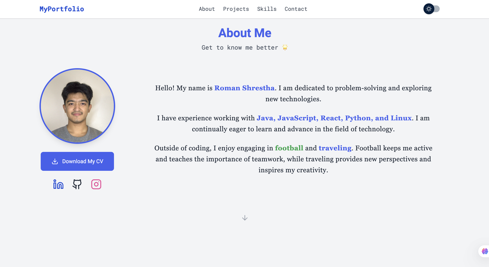
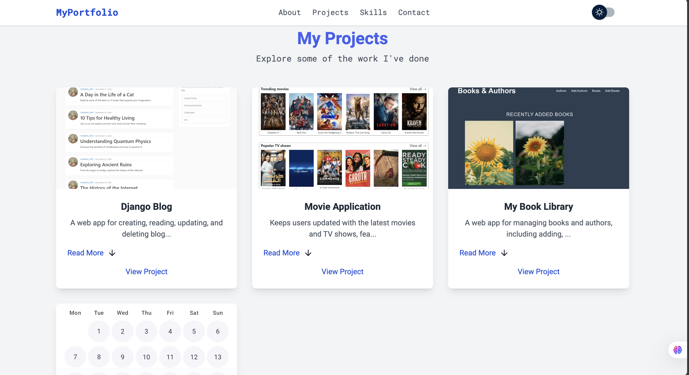
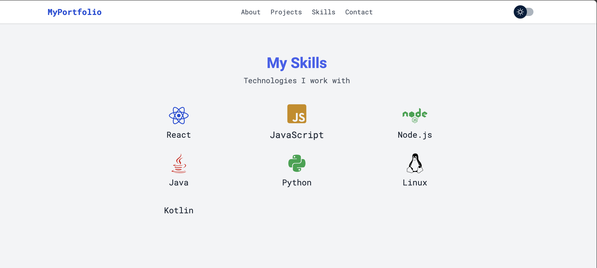
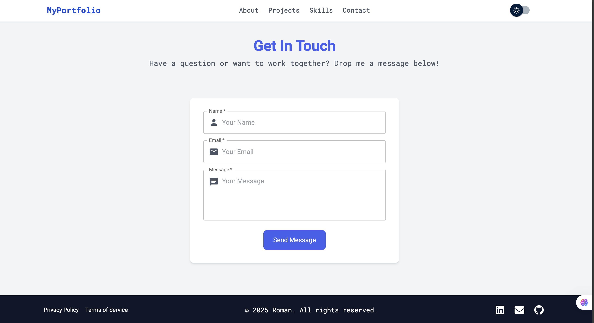

# Roman Shrestha's Portfolio

A section-based portfolio site built with React 19, Tailwind CSS, Framer Motion, and Material UI. It presents Roman Shrestha's about section, project archive, skills desk, and contact form in a responsive editorial layout with dark mode support and smooth in-page navigation.

[](https://github.com/romanshrestha20/portfolio/actions/workflows/pages/pages-build-deployment)
[](https://github.com/romanshrestha20/portfolio/actions/workflows/deploy.yml)
[](https://reactjs.org/)
[](https://tailwindcss.com/)
[](https://www.framer.com/motion/)

🔗 **Live Demo:** [romanshrestha.info](https://romanshrestha.info)

---

## Table of Contents

- [Features](#features)
- [Tech Stack](#tech-stack)
- [Project Structure](#project-structure)
- [Getting Started](#getting-started)
- [Screenshots](#screenshots)
- [Contributing](#contributing)
- [License](#license)
- [Contact](#contact)

---

## Features

- Section-based navigation with a fixed navbar, desktop table-of-contents links, and a mobile hamburger menu.
- Dark mode that respects system preference on first load and persists the selected theme in localStorage.
- About section with profile card, social links, timeline, and short feature cards describing current focus and stack.
- Project archive with six case-study style project entries, live/code links where available, and a modal detail view.
- Skills section rendered as a bento-style grid covering frontend systems, backend logic, mobile work, habits, and tooling.
- Contact form with field-level validation, loading state, and EmailJS delivery.
- Error boundary wrapper around the main app sections for runtime resilience.
- Fully responsive layout with Tailwind-driven styling and motion-enhanced transitions.

---

## Tech Stack

### Frontend

- React 19
- JavaScript (ES6+)
- Framer Motion
- Tailwind CSS 3.4.17
- Material UI 6.3.0
- Lucide React
- React Icons
- MUI icons

### Form and State

- EmailJS for contact form submission
- LocalStorage for dark mode persistence

### Build and Deployment

- react-scripts 5.0.1
- Tailwind CLI in the build pipeline
- PostCSS and Autoprefixer
- gh-pages for GitHub Pages deployment
- GitHub Actions workflows for automated deployment

---

## Project Structure

```plaintext
portfolio/
├── public/
│   ├── images/
│   │   ├── contact.png
│   │   ├── homepage.png
│   │   ├── projects.png
│   │   └── skills.png
│   ├── index.html
│   ├── manifest.json
│   └── robots.txt
├── src/
│   ├── components/
│   │   ├── about/
│   │   ├── common/
│   │   ├── contact/
│   │   ├── footer/
│   │   ├── home/
│   │   ├── navbar/
│   │   ├── projects/
│   │   └── skills/
│   ├── config/
│   │   └── sections.js
│   ├── data/
│   │   └── projects.js
│   ├── hooks/
│   │   └── useDarkMode.jsx
│   ├── App.js
│   ├── App.css
│   ├── index.js
│   └── index.css
├── package.json
├── tailwind.config.js
└── README.md
```

### Key Components

- `src/config/sections.js` defines the render order for Navbar, About, Projects, Skills, Contact, and Footer.
- `src/data/projects.js` holds the six project entries used in the archive.
- `src/hooks/useDarkMode.jsx` manages theme selection and syncs the `dark` class on the document root.
- `src/components/contact/ContactForm.jsx` handles form validation and EmailJS submission.

---

## Getting Started

### Prerequisites

- Node.js 16 or newer
- npm or yarn

### Install and Run

```bash
git clone https://github.com/romanshrestha20/portfolio.git
cd portfolio
npm install
npm start
```

The app opens at http://localhost:3000.

### Optional Environment Variables

Create a `.env` file in the project root if you want to enable the contact form:

```bash
REACT_APP_EMAILJS_SERVICE_ID=your_service_id
REACT_APP_EMAILJS_TEMPLATE_ID=your_template_id
REACT_APP_EMAILJS_USER_ID=your_user_id
```

### Available Scripts

```bash
npm start
npm run build
npm test
npm run deploy
```

`npm run build` compiles the React app and then generates the Tailwind CSS output used by the site.

---

## Screenshots

### Home and About



### Projects



### Skills



### Contact



---

## Contributing

Contributions, issues, and suggestions are welcome.

1. Fork the repository.
2. Create a branch for your change.
3. Make your edits and test locally.
4. Open a pull request.

---

## License

This project is licensed under the MIT License. See the [LICENSE](LICENSE) file for details.

---

## Contact

- Email: [stha.roman20@outlook.com](mailto:stha.roman20@outlook.com)
- LinkedIn: [linkedin.com/in/romanshrr](https://linkedin.com/in/romanshrr/)
- GitHub: [github.com/romanshrestha20](https://github.com/romanshrestha20)

Visit the live site at [romanshrestha.info](https://romanshrestha.info).
